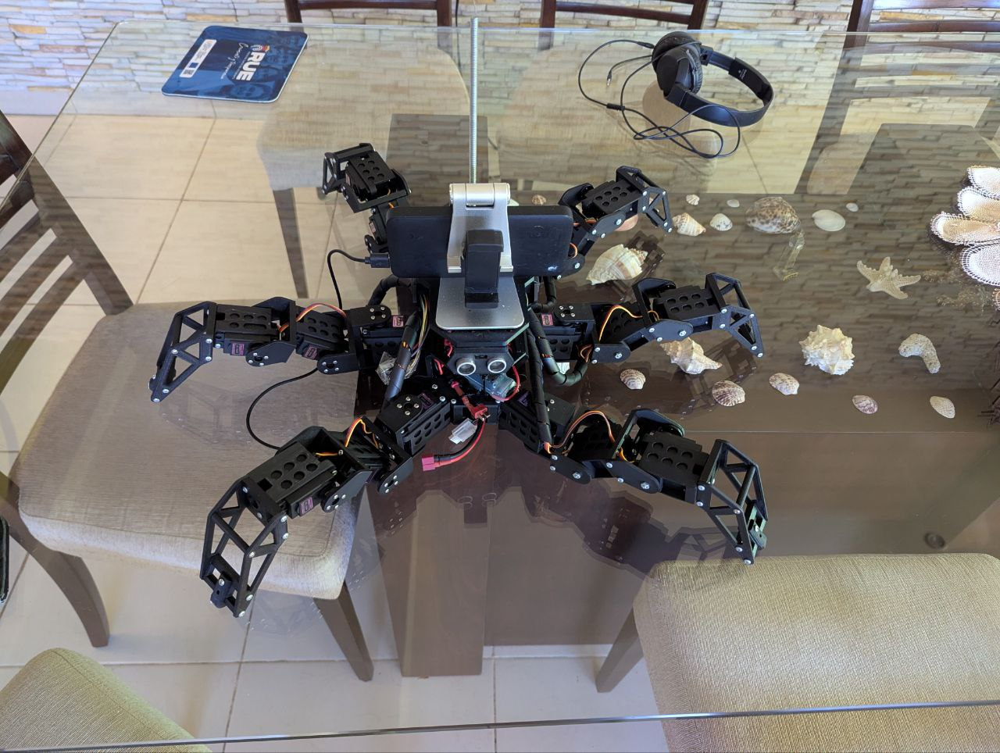
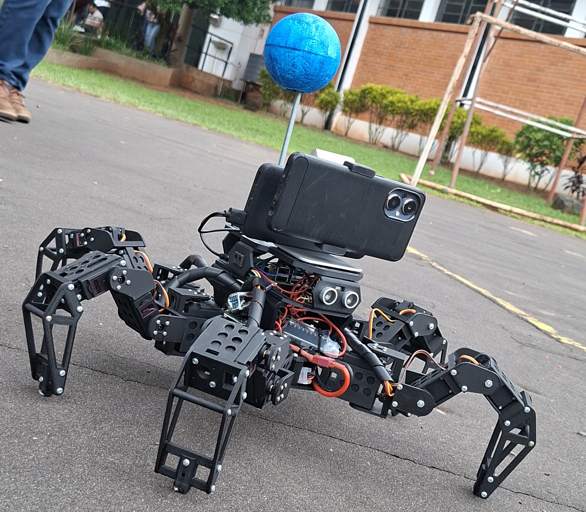
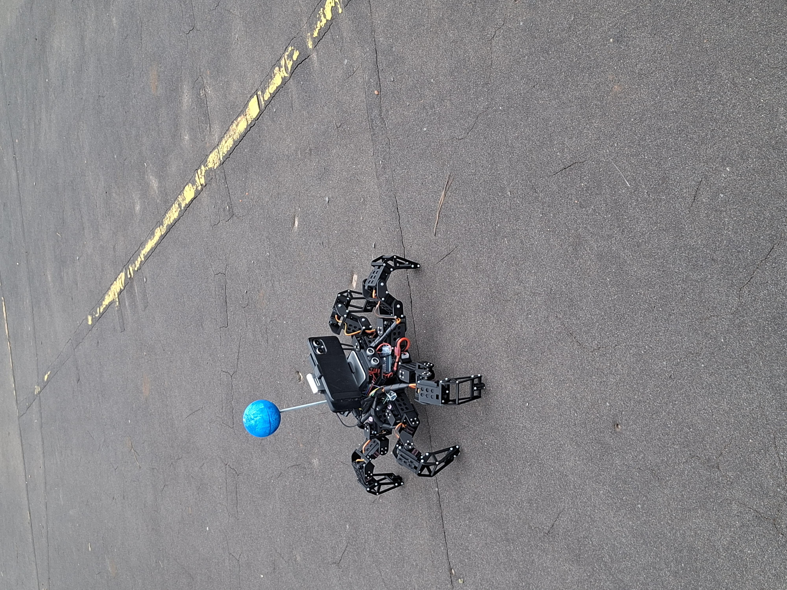

# Real Robot Demonstrations

<p align="center">
  
</p>

> **Part of the [Hexapod Project](https://github.com/Spin7/Hexapod-Project)**  
> 9 videos of the hexapod robot operating on **real hardware**: Raspberry Pi 4 + Arduino Mega + 18 servo motors. Real sensors, real noise, real world.

🎬 **YouTube Playlist:** [Hexapod Project — Real Robot (Raspberry Pi + Arduino)](#-add-playlist-link-here)

---

## 📸 Robot Photos

<p align="center">
  
  
</p>
<p align="center">
  
</p>

---

## 🔧 Hardware Stack

| Component | Details |
|---|---|
| 🖥️ **PC** | ASUS TUF Gaming F15 — NVIDIA RTX 3060 · Ubuntu 24.04 |
| 🍓 **Raspberry Pi** | Pi 4 (4 GB) · Ubuntu 24.04 — sensor reading + ROS2 |
| 🔌 **Arduino Mega** | 18 servos (3 DOF × 6 legs) · IK firmware · 50 Hz |
| 📱 **Google Pixel 7** | GPS + IMU (SensorServer) + camera (IriunWebCam) |
| 📡 **Sensors** | HC-SR04 ultrasonic · BerryIMU · IR proximity |

---

## 🎬 Video Index

> **How to watch:** Click the thumbnail or title to open the video on YouTube.

---

### Part 1 — DDS Communication Launch

**File:** `1_Hexapod_dds_comunication_launch.mp4`  
**Title:** *Hexapod Project - Real Robot Part 1 (DDS Communication Launch)*

<p align="center">
  <a href="https://youtu.be/VLH7wAWyUxs">
    
  </a>
</p>
<p align="center"><em>▶ Click to watch on YouTube</em></p>

**Description:**  
The first step to operating the real hexapod robot is establishing the **DDS communication bridge** between the PC (running ROS2) and the robot (Raspberry Pi + Arduino Mega).

This launch starts:
- 📻 DDS fast listener — IMU, ultrasonic, IR, camera data
- 📡 DDS reliable listener — GPS data
- 📢 DDS command talker — `cmd_robot` → serial → Arduino

Without this layer, the real robot is completely **blind and deaf**.

**Stack:** `ROS2 Jazzy` · `Raspberry Pi 4` · `Arduino Mega` · `DDS / Fast-DDS`

**Launch commands:**
```bash
# On Raspberry Pi:
ros2 launch hexapod_pkg read_sensors_rasberrypi.launch.py

# On PC:
ros2 launch hexapod_pkg dds_comunication.launch.py
```

---

### Part 2 — Teleoperation

**File:** `2_Hexapod_teleop_node.mp4`  
**Title:** *Hexapod Project - Real Robot Part 2 (Teleoperation)*

<p align="center">
  <a href="https://youtu.be/U2Dk3tRs2tY">
    
  </a>
</p>
<p align="center"><em>▶ Click to watch on YouTube</em></p>

**Description:**  
With the DDS communication bridge active, in this video I take direct manual control of the physical hexapod robot using **keyboard-based teleoperation**.

Each keypress travels through the full stack:
```
PC → DDS talker → serial protocol → Arduino Mega → servo motors
```

You can see the real hexapod walking, turning, and responding in real time to keyboard inputs.

**Stack:** `ROS2 Jazzy` · `Raspberry Pi 4` · `Arduino Mega` · `teleop node`

**Launch command:**
```bash
ros2 launch hexapod_pkg dds_comunication.launch.py
# Then in a new terminal:
ros2 run hexapod_pkg teleop_hexapod
```

---

### Part 3 — Auto-Balance Controller

**File:** `3_Hexapod_autobalance_node.mp4`  
**Title:** *Hexapod Project - Real Robot Part 3 (Auto-Balance Controller)*

<p align="center">
  <a href="https://youtu.be/IZbR-sUqEJs">
    
  </a>
</p>
<p align="center"><em>▶ Click to watch on YouTube</em></p>

**Description:**  
The **balance controller** adds a postural correction layer that runs between navigation commands and raw servo actuation.

Using IMU data and estimated body orientation, the controller continuously compensates for:
- ⛰️ Uneven terrain
- ⚙️ Servo delays and mechanical asymmetry
- 🔄 Roll and pitch disturbances

In this video you can see the real hexapod actively stabilizing its body while moving — improving gait robustness on real surfaces.

**Stack:** `ROS2 Jazzy` · `IMU` · `BerryIMU` · `Raspberry Pi 4` · `Arduino Mega`

---

### Part 4 — Sensor Computation Layer

**File:** `4_Hexapod_compute_sensors_launch.mp4`  
**Title:** *Hexapod Project - Real Robot Part 4 (Sensor Computation Layer)*

<p align="center">
  <a href="https://youtu.be/g3vVCbwPKyo">
    
  </a>
</p>
<p align="center"><em>▶ Click to watch on YouTube</em></p>

**Description:**  
Before running any autonomous behavior on the real robot, the sensor computation stack must be active. This launch processes data from real hardware sensors into navigation-ready signals:

- 📍 GPS → local XY coordinates
- 🧭 Phone magnetometer → orientation angle
- 📐 Dead-reckoning position estimate
- 📡 Ultrasonic → obstacle distances in meters
- 🔎 Master monitor for system health

This is the **real-world equivalent** of the simulation sensor layer.

**Stack:** `ROS2 Jazzy` · `GPS` · `BerryIMU` · `Ultrasonic` · `Google Pixel 7`

**Launch command:**
```bash
ros2 launch hexapod_pkg dds_comunication.launch.py
ros2 launch hexapod_pkg sensors_compute_real.launch.py
```

---

### Part 5 — Vision-Based Follower Launch

**File:** `5_Hexapod_follower_launch.mp4`  
**Title:** *Hexapod Project - Real Robot Part 5 (Vision-Based Follower Launch)*

<p align="center">
  <a href="https://youtu.be/iJXCLiiwyK0">
    
  </a>
</p>
<p align="center"><em>▶ Click to watch on YouTube</em></p>

**Description:**  
Launching the **follower mode** on the real physical hexapod robot. The robot uses a camera (phone / USB webcam) and a YOLO model to detect a target object and follow it in real time.

This video shows the launch sequence and system initialization — camera node, YOLO detector, and the follower navigation node all coming online together.

**Stack:** `ROS2 Jazzy` · `YOLO (Ultralytics)` · `OpenCV` · `Google Pixel 7`

**Launch command:**
```bash
ros2 launch hexapod_pkg dds_comunication.launch.py
ros2 launch hexapod_pkg sensors_compute_real.launch.py
ros2 launch hexapod_pkg follower_real.launch.py
```

---

### Part 6 — Swarm Follower Launch

**File:** `6_Hexapod_swarm_follower_launch.mp4`  
**Title:** *Hexapod Project - Real Robot Part 6 (Swarm Follower Launch)*

<p align="center">
  <a href="https://youtu.be/b_1az8GlGhw">
    
  </a>
</p>
<p align="center"><em>▶ Click to watch on YouTube</em></p>

**Description:**  
Launching the **swarm follower mode** on the real hexapod. This behavior is designed for multi-robot coordination, where each unit follows a leader using vision and obstacle-aware navigation.

In single-robot operation (shown here), the swarm logic acts as a compact reactive follower. This video covers the full launch sequence including YOLO vision and the swarm navigation node initialization.

**Stack:** `ROS2 Jazzy` · `YOLO` · `Raspberry Pi 4` · `Arduino Mega`

**Launch command:**
```bash
ros2 launch hexapod_pkg dds_comunication.launch.py
ros2 launch hexapod_pkg sensors_compute_real.launch.py
ros2 launch hexapod_pkg swarm_follower_real.launch.py
```

---

### Part 7 — GPS Navigation Launch

**File:** `7_Hexapod_gps_navigation_launch.mp4`  
**Title:** *Hexapod Project - Real Robot Part 7 (GPS Navigation Launch)*

<p align="center">
  <a href="https://youtu.be/4EwRCGkaTQo">
    
  </a>
</p>
<p align="center"><em>▶ Click to watch on YouTube</em></p>

**Description:**  
Launching the full **autonomous GPS navigation stack** on the real hexapod robot. This video shows the complete system initialization sequence:

- 🔗 DDS communication bridge
- 📡 Real sensor computation (GPS, IMU, ultrasonic)
- 👁️ YOLO cube detector
- 🗺️ Autonomous navigation planner with obstacle avoidance

All nodes coming online on real hardware before the robot begins its mission.

**Stack:** `ROS2 Jazzy` · `GPS` · `YOLO` · `Ultrasonic` · `Raspberry Pi 4` · `Arduino`

**Launch command:**
```bash
ros2 launch hexapod_pkg dds_comunication.launch.py
ros2 launch hexapod_pkg sensors_compute_real.launch.py
ros2 launch hexapod_pkg navigation_to_target_real.launch.py
```

---

### Part 8 — Follower Full Demo

**File:** `8_Hexapod_follower_demonstration.mp4`  
**Title:** *Hexapod Project - Real Robot Part 8 (Follower Full Demo)*

<p align="center">
  <a href="https://youtu.be/CMZotYHFU5w">
    
  </a>
</p>
<p align="center"><em>▶ Click to watch on YouTube</em></p>

**Description:**  
**Full demonstration** of the vision-based follower behavior running on the real physical hexapod robot.

The robot detects a moving target using YOLO and autonomously follows it through real-world space — dealing with:
- Real camera latency
- Physical motion instability
- Lighting and environment variation
- Obstacle avoidance on real terrain

A complete end-to-end test of the **perception → navigation pipeline** on real hardware.

**Stack:** `ROS2 Jazzy` · `YOLO` · `OpenCV` · `Raspberry Pi 4` · `Arduino Mega`

---

### Part 9 — GPS Navigation Full Demo

**File:** `9_Hexapod_gps_navigation_demonstration.mp4`  
**Title:** *Hexapod Project - Real Robot Part 9 (GPS Navigation Full Demo)*

<p align="center">
  <a href="https://youtu.be/iqLUGNQwuDo">
    
  </a>
</p>
<p align="center"><em>▶ Click to watch on YouTube</em></p>

**Description:**  
The **crown jewel** of the real robot series — a full end-to-end autonomous GPS navigation demonstration with obstacle avoidance.

The hexapod:
1. 🛰️ Receives a GPS target coordinate
2. 📍 Estimates its own position using GPS + dead-reckoning
3. 🧭 Computes heading from the phone's magnetometer
4. 📡 Detects obstacles with ultrasonic sensors
5. 👁️ Detects the target cube using YOLO
6. 🔄 Plans and replans motion commands continuously
7. 🏁 Reaches the goal while avoiding everything in its path

All of this running on real hardware, in the real world.

**Stack:** `ROS2 Jazzy` · `GPS` · `YOLO` · `IMU` · `Ultrasonic` · `Raspberry Pi 4` · `Arduino Mega`

---

## Common Setup (All Real Robot Modes)

```bash
# ─── On Raspberry Pi ───────────────────────────────────────
source /opt/ros/jazzy/setup.bash
source ~/ros2_hexapod_ws/install/setup.bash
ros2 launch hexapod_pkg read_sensors_rasberrypi.launch.py

# ─── On PC ─────────────────────────────────────────────────
source /opt/ros/jazzy/setup.bash
source ~/ros2_hexapod_ws/install/setup.bash

# (Modes with YOLO) Activate Python venv in a separate terminal
source ~/.venvs/yolo/bin/activate

# Start DDS bridge (ALWAYS first on PC)
ros2 launch hexapod_pkg dds_comunication.launch.py
```

> 📦 Full setup instructions: [1_ROS2_Gazebo_Project/README.md](../../1_ROS2_Gazebo_Project/README.md)
