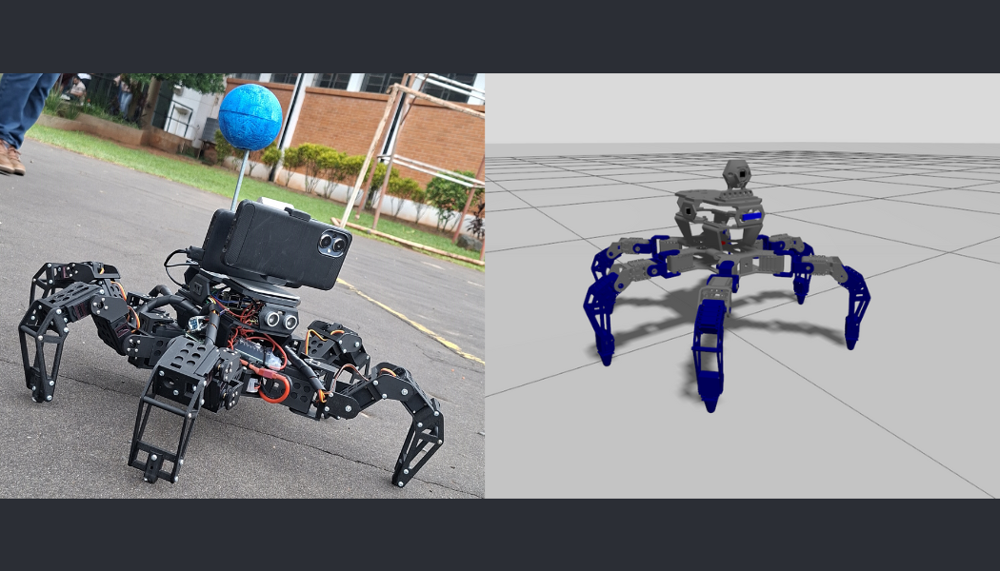
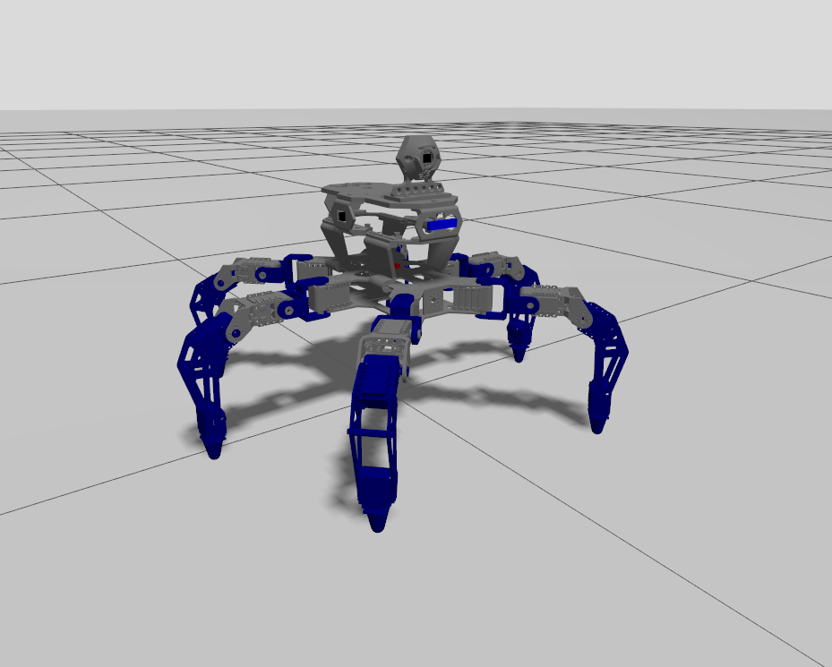
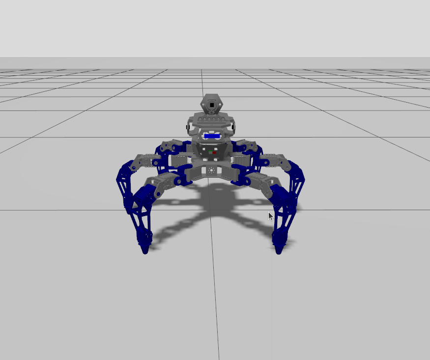
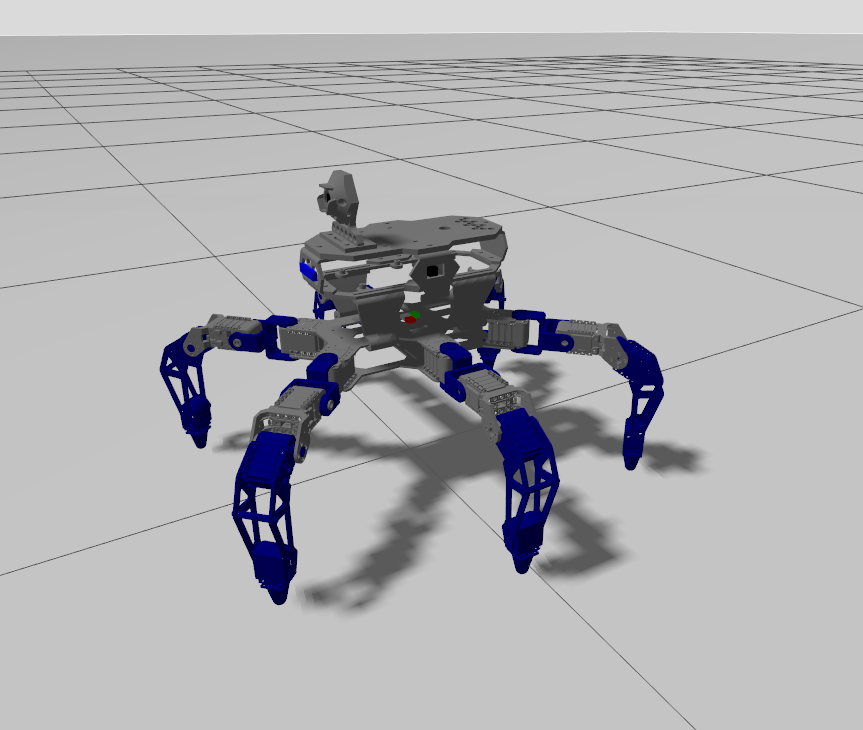
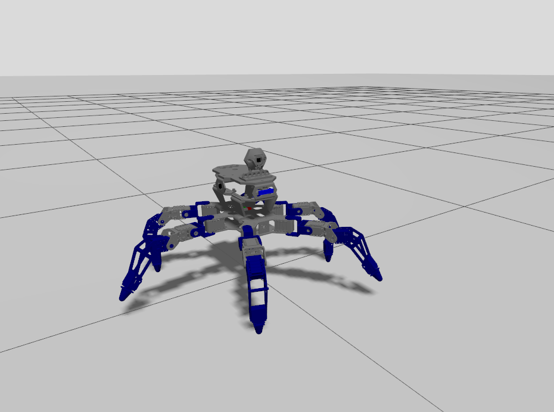
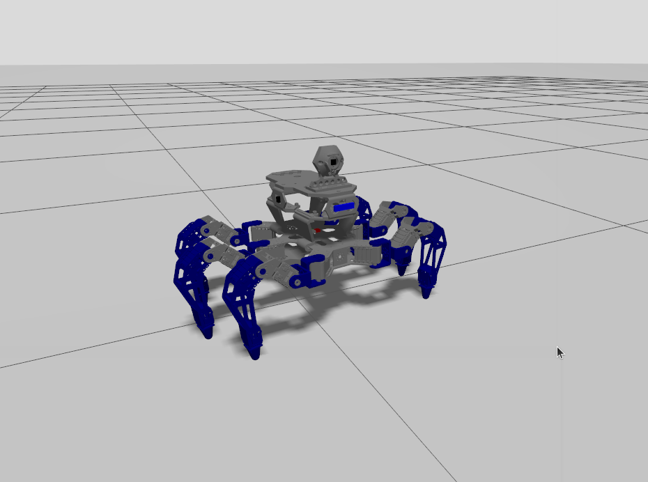
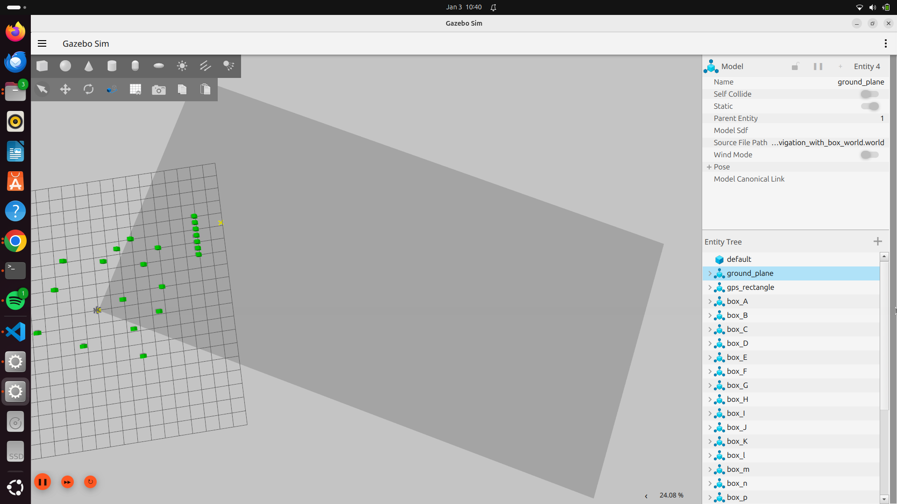
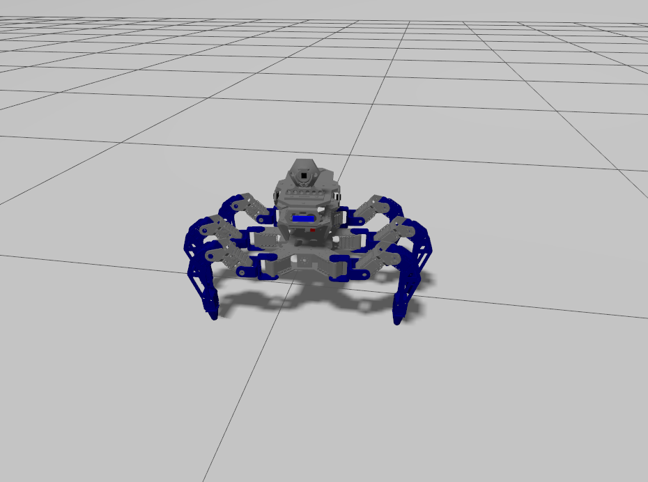

# 🎮 Simulation Robot Demonstrations

<p align="center">
  
</p>

> **Part of the [Hexapod Project](https://github.com/Spin7/Hexapod-Project)**  
> 7 videos showing the hexapod robot operating inside **Gazebo Harmonic** with **ROS2 Jazzy** — no physical hardware required.

🎬 **YouTube Playlist:** [Hexapod Project — Simulation (Gazebo + ROS2)](#-add-playlist-link-here)

---

## 📸 Simulation Screenshots

<p align="center">
  
  
  
</p>
<p align="center">
  
  
  
</p>

---

## 🎬 Video Index

> **How to watch:** Click the thumbnail or title to open the video on YouTube.  
> Thumbnails are taken from the simulation screenshots above.

---

### Part 1 — Gazebo Launch

**File:** `1_Hexapod_gazebo_launch.mp4`  
**Title:** *Hexapod Project - Simulation Part 1 (Gazebo Launch)*

<p align="center">
  <a href="https://youtu.be/VrdOxer3bfk">
    
  </a>
</p>
<p align="center"><em>▶ Click to watch on YouTube</em></p>

**Description:**  
In this first simulation video, I launch the full Gazebo + ROS2 environment for my hexapod robot project. You'll see the robot model being spawned into the virtual world, the ros2_control joints initializing, and the complete simulation pipeline coming to life.

This is the **mandatory first step** before running any behavior mode — Gazebo provides the physics engine, sensor simulation, and the communication bridge between the robot and the ROS2 nodes.

**Stack:** `ROS2 Jazzy` · `Gazebo Harmonic` · `ros_gz_bridge` · `URDF/XACRO`

**Launch command:**
```bash
ros2 launch hexapod_pkg gazebo_hexapod_sim.launch.py
```

---

### Part 2 — Teleoperation

**File:** `2_Hexapod_teleop_node_sim.mp4`  
**Title:** *Hexapod Project - Simulation Part 2 (Teleoperation)*

<p align="center">
  <a href="https://youtu.be/bPy6ompV-m8">
    
  </a>
</p>
<p align="center"><em>▶ Click to watch on YouTube</em></p>

**Description:**  
With the Gazebo simulation running, in this video I take manual control of the hexapod robot using the teleoperation node. Keyboard inputs are translated in real time into motion commands, controlling the direction and gait of the robot inside the simulated environment.

Teleop is a key tool for **debugging, calibration**, and verifying that the low-level control layer is working correctly before deploying any autonomous behavior.

**Stack:** `ROS2 Jazzy` · `Gazebo Harmonic` · `teleop_hexapod_sim node`

**Launch command:**
```bash
ros2 launch hexapod_pkg gazebo_hexapod_sim.launch.py
# Then in a new terminal:
ros2 run hexapod_pkg teleop_hexapod_sim
```

---

### Part 3 — Sensor Computation Layer

**File:** `3_Hexapod_sensors_compute_sim.mp4`  
**Title:** *Hexapod Project - Simulation Part 3 (Sensor Computation Layer)*

<p align="center">
  <a href="https://youtu.be/xsyxHJcdykU">
    
  </a>
</p>
<p align="center"><em>▶ Click to watch on YouTube</em></p>

**Description:**  
Before enabling any autonomous navigation, the sensor computation layer must be active. This launch processes raw Gazebo sensor data into high-level signals:

- 📍 GPS lat/lon → local XY coordinates
- 🧭 IMU + magnetometer → heading angle
- 📐 Dead-reckoning position estimate
- 📡 Ultrasonic → obstacle distances in meters
- 🔎 Master monitor for system health

This "nervous system" layer is what allows the robot to know **where it is** and **what's around it**.

**Stack:** `ROS2 Jazzy` · `Gazebo` · `GPS` · `IMU` · `Ultrasonic sensors`

**Launch command:**
```bash
# Terminal 1
ros2 launch hexapod_pkg gazebo_hexapod_sim.launch.py
# Terminal 2
ros2 launch hexapod_pkg sensors_compute_sim.launch.py
```

---

### Part 4 — Vision-Based Follower

**File:** `4_Hexapod_follower_sim.mp4`  
**Title:** *Hexapod Project - Simulation Part 4 (Vision-Based Follower)*

<p align="center">
  <a href="https://youtu.be/TKISpMUWDwg">
    
  </a>
</p>
<p align="center"><em>▶ Click to watch on YouTube</em></p>

**Description:**  
In this demo, the hexapod autonomously follows a moving object detected by the camera using a **YOLO-based computer vision model**. The robot continuously tracks the target's position in the image and generates reactive motion commands to pursue it while avoiding obstacles.

This mode showcases the integration between the vision pipeline (YOLO inference) and the navigation layer running entirely inside Gazebo simulation.

**Stack:** `ROS2 Jazzy` · `Gazebo` · `YOLO (Ultralytics)` · `PyTorch`

**Launch command:**
```bash
ros2 launch hexapod_pkg gazebo_hexapod_sim.launch.py
ros2 launch hexapod_pkg sensors_compute_sim.launch.py
ros2 launch hexapod_pkg follower_sim.launch.py
```

---

### Part 5 — Swarm Follower

**File:** `5_Hexapod_swarm_follower_sim.mp4`  
**Title:** *Hexapod Project - Simulation Part 5 (Swarm Follower)*

<p align="center">
  <a href="https://youtu.be/z2tB1xrgj1U">
    
  </a>
</p>
<p align="center"><em>▶ Click to watch on YouTube</em></p>

**Description:**  
This video demonstrates the **swarm follower mode** — a behavior designed to scale to multiple robots operating collectively. Using YOLO-based detection and obstacle-aware navigation, the hexapod follows a target using coordination logic inspired by swarm robotics principles.

In single-robot mode (shown here), the swarm logic collapses into a compact follower behavior, but the architecture is ready to support multiple agents.

**Stack:** `ROS2 Jazzy` · `Gazebo` · `YOLO` · `Swarm navigation node`

**Launch command:**
```bash
ros2 launch hexapod_pkg gazebo_hexapod_sim.launch.py
ros2 launch hexapod_pkg sensors_compute_sim.launch.py
ros2 launch hexapod_pkg swarm_follower_sim.launch.py
```

---

### Part 6 — Autonomous GPS Navigation

**File:** `6_Hexapod_gps_navigation_sim.mp4`  
**Title:** *Hexapod Project - Simulation Part 6 (Autonomous GPS Navigation)*

<p align="center">
  <a href="https://youtu.be/vps-d9vtT4c">
    
  </a>
</p>
<p align="center"><em>▶ Click to watch on YouTube</em></p>

**Description:**  
Full autonomous navigation to a GPS target with real-time obstacle avoidance — all inside Gazebo simulation.

The hexapod uses:
- 🛰️ Simulated GPS for global positioning
- 📐 Dead-reckoning for position estimation
- 👁️ YOLO vision for target detection (cube)
- 📡 Ultrasonic sensors for obstacle awareness
- 🔄 A continuous replanning navigation loop

This is the **most complex simulation mode**, combining all the sensor and navigation layers into a unified autonomous system.

**Stack:** `ROS2 Jazzy` · `Gazebo` · `GPS` · `YOLO` · `Obstacle Avoidance`

**Launch command:**
```bash
ros2 launch hexapod_pkg gazebo_hexapod_sim.launch.py
ros2 launch hexapod_pkg sensors_compute_sim.launch.py
ros2 launch hexapod_pkg navigation_to_target_sim.launch.py
```

---

### Part 7 — Social Robot (Hand Gestures)

**File:** `7_Hexapod_social_robot_launch_sim.mp4`  
**Title:** *Hexapod Project - Simulation Part 7 (Social Robot — Hand Gestures)*

<p align="center">
  <a href="https://youtu.be/Hdm6wiWA3Ro">
    
  </a>
</p>
<p align="center"><em>▶ Click to watch on YouTube</em></p>

**Description:**  
In this final simulation demo, the hexapod responds to human hand gestures captured by the camera. Using **MediaPipe landmark detection**, specific gestures are recognized and translated into symbolic robot actions:

| Gesture | Robot Reaction |
|---|---|
| ROCK | Aggressive pose / stomp |
| VICTORY | Celebration sequence |
| AL_PELO | Custom expressive motion |

This social interaction layer is purely experimental, exploring how a hexapod can act as an **expressive social robot** — reacting to its human partner in real time.

**Stack:** `ROS2 Jazzy` · `Gazebo` · `MediaPipe` · `OpenCV` · `hand_gesture_node`

**Launch command:**
```bash
ros2 launch hexapod_pkg gazebo_hexapod_sim.launch.py
ros2 launch hexapod_pkg social_robot_sim.launch.py
```

---

## Common Setup (All Simulation Modes)

```bash
# 1. Source ROS2 and workspace
source /opt/ros/jazzy/setup.bash
source ~/ros2_hexapod_ws/install/setup.bash

# 2. (Modes with YOLO) Activate Python venv
source ~/.venvs/yolo/bin/activate

# 3. Launch Gazebo (ALWAYS first)
ros2 launch hexapod_pkg gazebo_hexapod_sim.launch.py
```

> Full setup instructions: [1_ROS2_Gazebo_Project/README.md](../../1_ROS2_Gazebo_Project/README.md)
