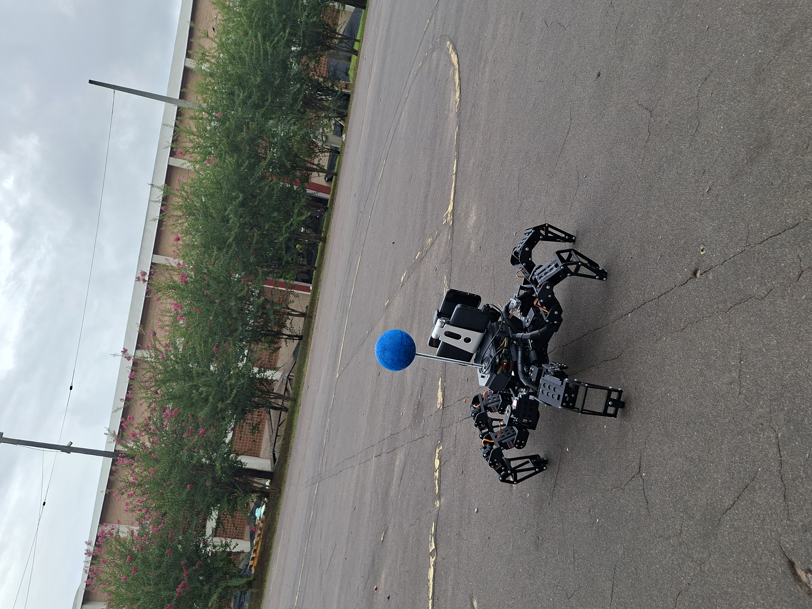

# Hexapod Project

<p align="center">
  
</p>

<p align="center">
  <em>Left: Physical hexapod robot in action · Right: Gazebo simulation counterpart</em>
</p>

<p align="center">
  
  
  
  
  
  
</p>

---

## Overview

This repository contains the complete development of a **6-legged autonomous robot (hexapod)** — from mechanical 3D design and embedded firmware, to a full ROS2 software stack running in both **Gazebo simulation** and on the **physical robot**.

The core philosophy is **dual-execution**: one shared intelligence layer drives two physical realities. The same high-level behaviors — autonomous navigation, vision-based following, swarm coordination, hand-gesture interaction — run identically on the simulator and the real hardware. The only difference is the actuation layer.

```
Behavior / Navigation / Social Logic
              ↓
      cmd_robot (std_msgs/String)
              ↓
  ┌───────────────────────────┐
  │ SIMULATION                │     │ REAL ROBOT                │
  │  gz_hexapod_low_level     │     │  dds_cmd_talker           │
  │    → joint trajectories   │     │    → serial → Arduino     │
  └───────────────────────────┘     └───────────────────────────┘
```

---

## Hardware Platform

| Component | Details |
|---|---|
| 🖥️ **PC** | ASUS TUF Gaming F15 — NVIDIA RTX 3060 · Ubuntu 24.04 LTS |
| 🍓 **Raspberry Pi** | Raspberry Pi 4 (4 GB RAM) · Ubuntu 24.04 LTS |
| 🔌 **Microcontroller** | Arduino Mega (18 servo motors — 3 DOF × 6 legs) |
| 📱 **Smartphone** | Google Pixel 7 (camera + IMU sensors via SensorServer) |
| 🦿 **Mechanics** | Custom 3D-printed chassis · SolidWorks design |
| 📡 **Sensors** | HC-SR04 ultrasonic · IMU · GPS (via smartphone) · IR proximity |

---

## Repository Structure

```
Hexapod Project/
├── 1_ROS2_Gazebo_Project/       # Full ROS2 package (simulation + real robot)
├── 2_Arduino_Code/              # Arduino Mega firmware (IK + gait + serial control)
├── 3_3D_Design/                 # SolidWorks assembly + printable STL files
├── 4_SensorServer_App/          # Android app APK for phone sensor streaming
├── 5_Hexapod_Demonstrations/    # Video demos and side-by-side images
└── 6_Multimedia/                # Photos and media assets
```

---

## Modules

### 1 — ROS2 Gazebo Project

> **Path:** [`1_ROS2_Gazebo_Project/`](1_ROS2_Gazebo_Project/)  
> **See:** [`1_ROS2_Gazebo_Project/README.md`](1_ROS2_Gazebo_Project/README.md)

The brain of the system. A single colcon package (`hexapod_pkg`) that runs on both the PC (simulation and high-level control) and the Raspberry Pi (hardware sensor reading).

**Key node groups:**

| Module | Role |
|---|---|
| `dds_nodes` | DDS bridge — PC ↔ Arduino serial communication |
| `navigation_nodes` | GPS-based autonomous navigation + obstacle avoidance |
| `image_recognition_nodes` | YOLO object detection + MediaPipe hand tracking |
| `localization_and_orientation_nodes` | GPS, IMU heading, dead-reckoning fusion |
| `sensors_interfaces_nodes` | Ultrasonic sensor processing |
| `social_robot_nodes` | Hand-gesture-based human–robot interaction |
| `auto_balance_nodes` | IMU-driven postural correction (roll/pitch) |
| `gazebo_nodes` | Simulation-specific low-level joint control |
| `read_sensors_nodes` | Hardware sensor readers (Raspberry Pi side) |
| `teleop_nodes` | Keyboard / manual override |

**Operation modes:**

| Mode | Description |
|---|---|
| 🎯 **Follower** | YOLO-based visual target tracking and pursuit |
| 🗺️ **Navigation to Target** | GPS + heading + obstacle avoidance autonomous travel |
| 🐝 **Swarm Follower** | Leader-following with simplified collective rules |
| 🖐️ **Social Robot** | Hand gesture recognition (ROCK / VICTORY / AL_PELO) → motion commands |
| 🕹️ **Teleop** | Direct keyboard control for debugging and calibration |

---

### 2 — Arduino Code

> **Path:** [`2_Arduino_Code/`](2_Arduino_Code/)

Arduino Mega firmware written in C++. Receives high-level movement commands over serial from the Raspberry Pi (via ROS2 DDS bridge) and translates them into real-time servo trajectories using **Inverse Kinematics (IK)**.

**Key features:**
- 18 servo motors controlled at **50 Hz** (20 ms frame time)
- 3 DOF per leg: **Coxa · Femur · Tibia** — lengths: 51 mm / 65 mm / 121 mm
- IK-based foot placement for forward, backward, lateral, and rotational gaits
- Battery voltage monitoring (12V analog input)
- Includes a PDF wiring and setup guide ([`Arduino_Instructions.pdf`](2_Arduino_Code/Arduino_Instructions.pdf))

---

### 3 — 3D Design

> **Path:** [`3_3D_Design/`](3_3D_Design/)

Full mechanical design created in **SolidWorks**. The assembly (`Ensamblaje.SLDASM`) covers the entire robot structure with all sub-components modeled and parametrized.

**Printable STL parts include:**

| Part | Description |
|---|---|
| `Body_Top_Plate.stl` / `Body_Bottom_Plate.stl` | Main chassis plates |
| `Body_Riser.stl` | Chassis elevation spacers |
| `Femur_Bracket.stl` / `Femur_Bracket_End_Cap.stl` | Mid-leg structural brackets |
| `Tibia_Bracket.stl` / `Tibia_Side_1.stl` / `Tibia_Side_2.stl` | Lower leg components |
| `Tibia_Foot_Bumper.stl` / `Tibia_Foot_Plate.stl` | Foot contact surface |
| `Servo_Mount.stl` / `Servo_Bearing_Center.stl` | Servo attachment fixtures |
| `Wire_Guide.stl` | Cable management |
| `Receiver_Holder.stl` / `SBEC_Holder.stl` | Electronics holders |
| `Soporte/` | Mounting brackets for Raspberry Pi 5 and Pi Camera |

Additional sub-assemblies include custom mounts for the **HC-SR04** ultrasonic sensors and the **JS40F** servo joints. A full parts list is available at [`stl files/Robot/Parts-List.pdf`](3_3D_Design/Hexapod%203D%20model/stl%20files/Robot/Parts-List.pdf).

---

### 4 — SensorServer App

> **Path:** [`4_SensorServer_App/`](4_SensorServer_App/)  
> **GitHub:** [github.com/UmerCodez/SensorServer](https://github.com/UmerCodez/SensorServer)

An Android application that streams all smartphone sensors (GPS, accelerometer, gyroscope, magnetometer) over **WebSocket** to the ROS2 network. This turns a regular smartphone into a powerful sensor hub for the hexapod, providing:

- **GPS** — global position for autonomous navigation
- **IMU** — accelerometer + gyroscope + magnetometer for heading estimation
- **Camera** — phone camera streamed via **IriunWebCam** to the PC

The APK is included in this folder for direct installation.

---

### 5 — Hexapod Demonstrations

> **Path:** [`5_Hexapod_Demonstrations/`](5_Hexapod_Demonstrations/)  
> **See:** [`5_Hexapod_Demonstrations/README.md`](5_Hexapod_Demonstrations/README.md)

Video recordings of all operation modes on both the real robot and the simulation. Organized into two sub-folders:

<p align="center">
  
  
</p>
<p align="center">
  
  
  
</p>

**Real Robot Demonstrations (9 videos):**

| # | Video | Description |
|---|---|---|
| 1 | `1_Hexapod_dds_comunication_launch.mp4` | DDS bridge startup and Arduino handshake |
| 2 | `2_Hexapod_teleop_node.mp4` | Manual keyboard teleoperation |
| 3 | `3_Hexapod_autobalance_node.mp4` | Auto-balance / IMU stabilization |
| 4 | `4_Hexapod_compute_sensors_launch.mp4` | Sensor processing pipeline |
| 5 | `5_Hexapod_follower_launch.mp4` | Vision-based follower mode |
| 6 | `6_Hexapod_swarm_follower_launch.mp4` | Swarm follower behavior |
| 7 | `7_Hexapod_gps_navigation_launch.mp4` | GPS navigation setup |
| 8 | `8_Hexapod_follower_demonstration.mp4` | Full follower demo in real environment |
| 9 | `9_Hexapod_gps_navigation_demonstration.mp4` | Full autonomous GPS navigation demo |

**Simulation Demonstrations (7 videos):**

| # | Video | Description |
|---|---|---|
| 1 | `1_Hexapod_gazebo_launch.mp4` | Gazebo world startup and robot spawn |
| 2 | `2_Hexapod_teleop_node_sim.mp4` | Keyboard teleoperation in simulation |
| 3 | `3_Hexapod_sensors_compute_sim.mp4` | Sensor compute pipeline in simulation |
| 4 | `4_Hexapod_follower_sim.mp4` | Follower mode in Gazebo |
| 5 | `5_Hexapod_swarm_follower_sim.mp4` | Swarm follower in Gazebo |
| 6 | `6_Hexapod_gps_navigation_sim.mp4` | Full GPS navigation in simulation |
| 7 | `7_Hexapod_social_robot_launch_sim.mp4` | Hand gesture control in Gazebo |

---

### 6 — Multimedia

> **Path:** [`6_Multimedia/`](6_Multimedia/)

Raw photos and media assets of the physical robot from construction and testing sessions.

<p align="center">
  
  
</p>
<p align="center">
  
  
</p>

---

## Quick Start

### Prerequisites

- Ubuntu 22.04 or 24.04
- ROS2 Humble / Jazzy (recommended: Jazzy on Ubuntu 24.04)
- Gazebo Harmonic (`ros-jazzy-ros-gz`)
- Python 3 with `torch`, `ultralytics`, `opencv-python`
- Arduino IDE (for firmware upload)
- SolidWorks (for 3D model editing — STL files work without it)

### Clone & Build

```bash
# Create workspace
mkdir -p ~/ros2_hexapod_ws/src
cd ~/ros2_hexapod_ws/src

# Clone repository
git clone https://github.com/Spin7/Hexapod-Project.git

# Copy ROS2 package into workspace
cp -r Hexapod-Project/1_ROS2_Gazebo_Project/hexapod_pkg .

# Build
cd ~/ros2_hexapod_ws
colcon build --symlink-install
source install/setup.bash
```

### Run (Simulation)

```bash
# Terminal 1 — start Gazebo
ros2 launch hexapod_pkg gazebo_hexapod_sim.launch.py

# Terminal 2 — sensor processing
ros2 launch hexapod_pkg sensors_compute_sim.launch.py

# Terminal 3 — pick a mode
ros2 launch hexapod_pkg follower_sim.launch.py               # Vision follower
ros2 launch hexapod_pkg navigation_to_target_sim.launch.py  # GPS navigation
ros2 launch hexapod_pkg social_robot_sim.launch.py          # Hand gestures
ros2 launch hexapod_pkg swarm_follower_sim.launch.py        # Swarm
```

> See [`1_ROS2_Gazebo_Project/README.md`](1_ROS2_Gazebo_Project/README.md) for the full setup guide including real robot deployment.

---

## Architecture Diagram

```
┌──────────────────────────────────────────────────────────────────┐
│                         PC (Ubuntu 24.04)                        │
│                                                                  │
│  ┌─────────────────────────────────────────────────────────┐    │
│  │                    ROS2 Jazzy                           │    │
│  │                                                         │    │
│  │  ┌──────────┐  ┌──────────┐  ┌──────────┐  ┌────────┐ │    │
│  │  │ YOLO /   │  │   GPS    │  │ Obstacle │  │Gesture │ │    │
│  │  │ Camera   │  │ Navigation│  │ Avoidance│  │  HRI   │ │    │
│  │  └────┬─────┘  └────┬─────┘  └────┬─────┘  └───┬────┘ │    │
│  │       └─────────────┴─────────────┴─────────────┘      │    │
│  │                        cmd_robot                        │    │
│  │                            │                           │    │
│  │          ┌─────────────────┴─────────────────┐         │    │
│  │          │ SIMULATION          REAL ROBOT     │         │    │
│  │          │  Gazebo joints      DDS → Serial   │         │    │
│  │          └─────────────────────┬─────────────┘         │    │
│  └────────────────────────────────┼────────────────────────┘    │
└───────────────────────────────────┼──────────────────────────────┘
                                    │ Serial / USB
                         ┌──────────┴──────────┐
                         │   Raspberry Pi 4    │
                         │   (ROS2 sensors)    │
                         └──────────┬──────────┘
                                    │ Serial
                         ┌──────────┴──────────┐
                         │   Arduino Mega      │
                         │  18 servos — IK     │
                         └─────────────────────┘
                                    │
                         ┌──────────┴──────────┐
                         │  Smartphone (Pixel) │
                         │  GPS · IMU · Camera │
                         └─────────────────────┘
```

---

## License

This project is open source. Feel free to use, fork, and build on it.  
If you use this work in your own project, a mention or link back is appreciated.

---

<p align="center">
  Built with ROS2 · Gazebo · Arduino · SolidWorks · YOLO · MediaPipe
</p>